# Cartography Portfolio

A selection of professional and academic cartographic work focused on conflict mapping, geospatial analysis, and visual storytelling.

Tools include ArcGIS Pro, Python, SQL, and custom data visualization pipelines. Projects range from operational conflict mapping to graphical representation and academic cartography.
---

## Contents
- [Ukraine Conflict Mapping](#ukraine-conflict-mapping)
- [Phase Zero / Strike Graphics](#phase-zero--strike-graphics)
- [China / Taiwan](#china--taiwan)
- [Moldova](#moldova)
- [US / Local Inequality](#us--local-inequality)

---

## Ukraine Conflict Mapping

### Assessed Russian Gains in Ukraine (Map 1)
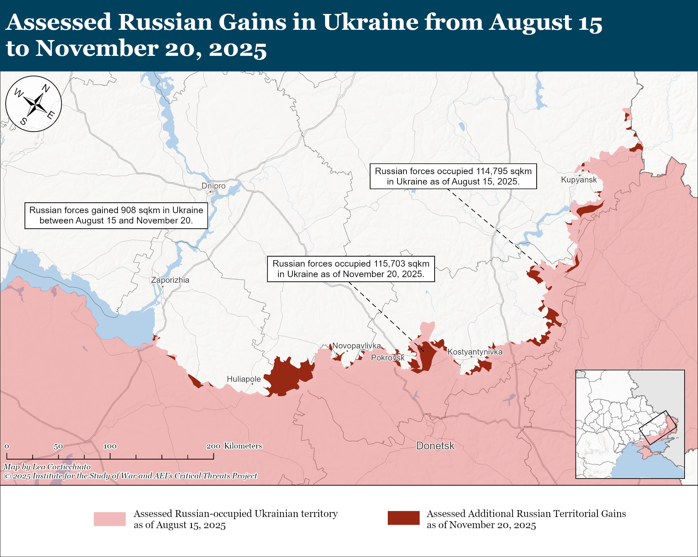

### Assessed Russian Gains in Ukraine (Map 2)
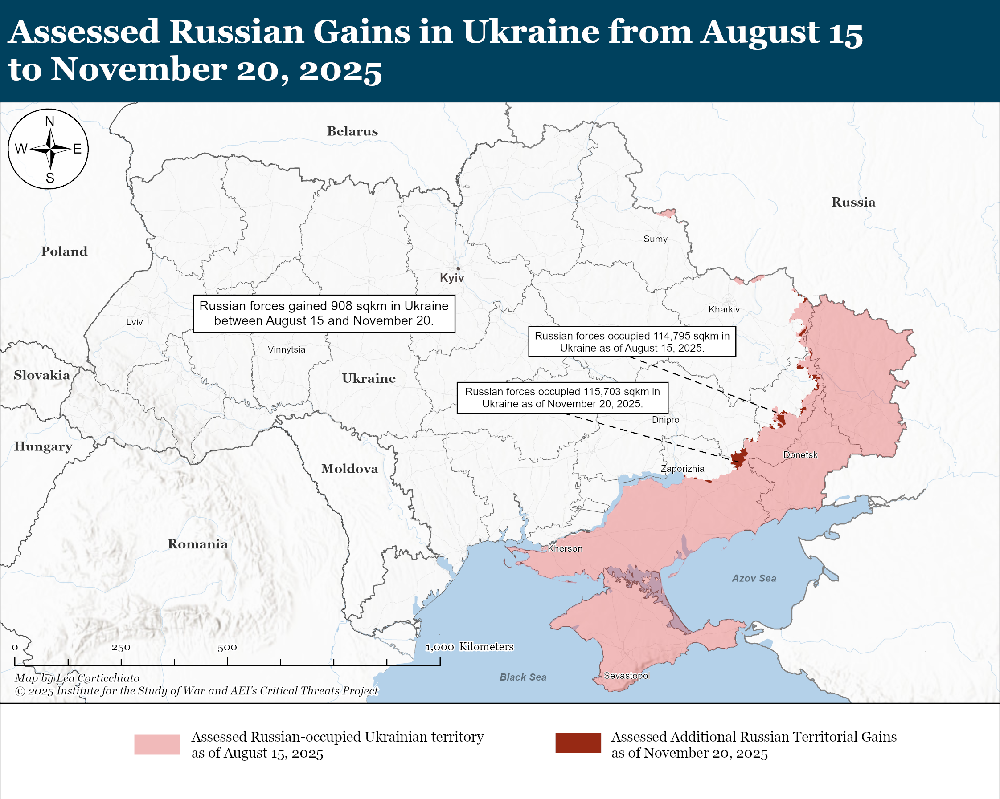

*ArcGIS Pro · November 2025 · Frontline area calculation and visualization*

---

## Phase Zero / Strike Graphics

### Phase Zero Map (Version 1)
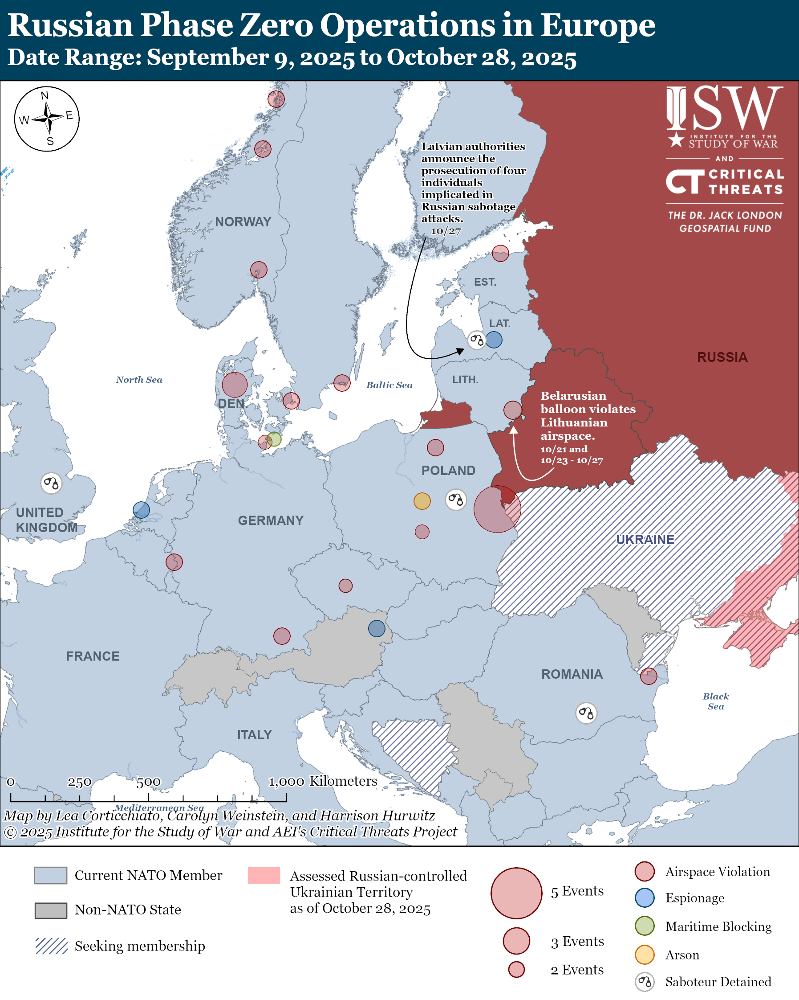

### Phase Zero Map (Version 2)
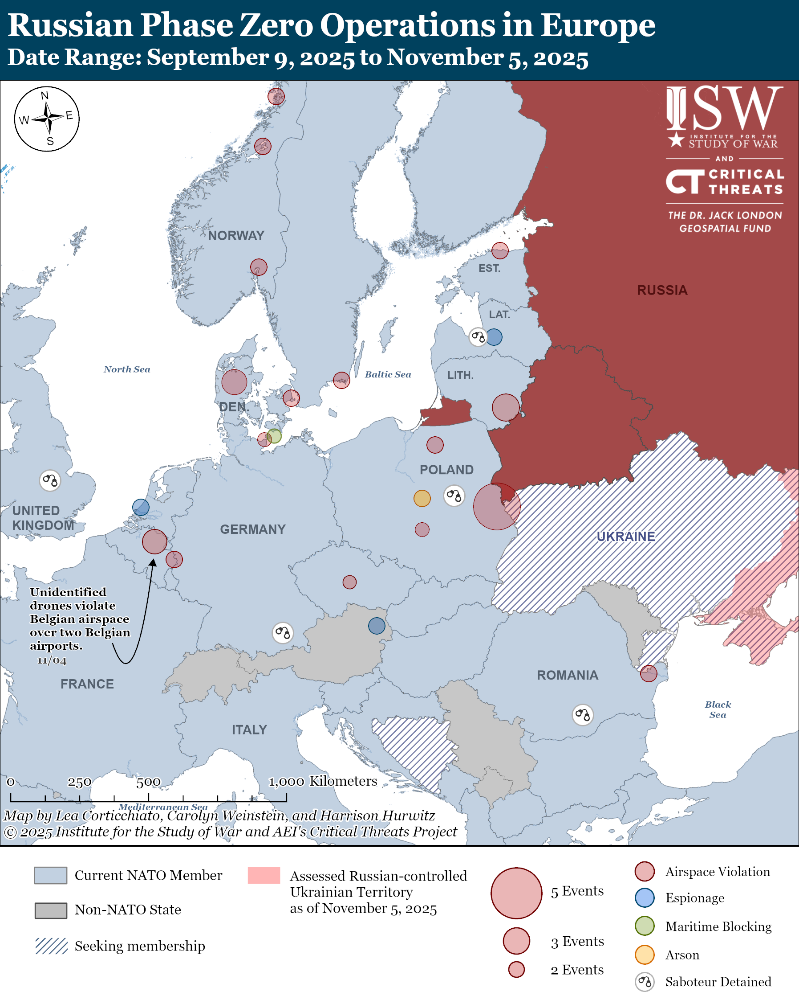

### Strike Graphic (1)
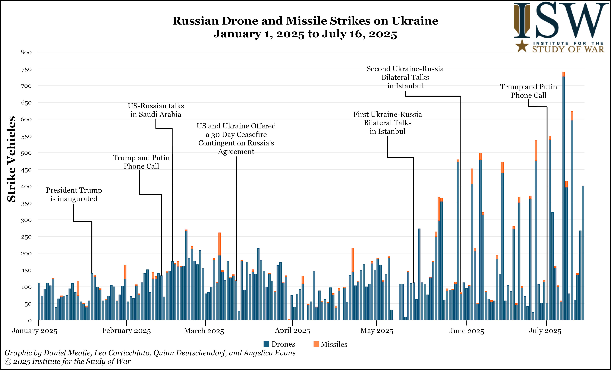

### Strike Graphic (2)
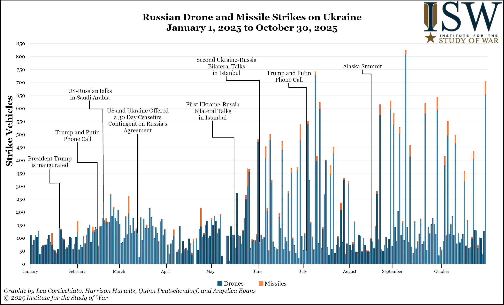

### Strike Graphic (Vertical)
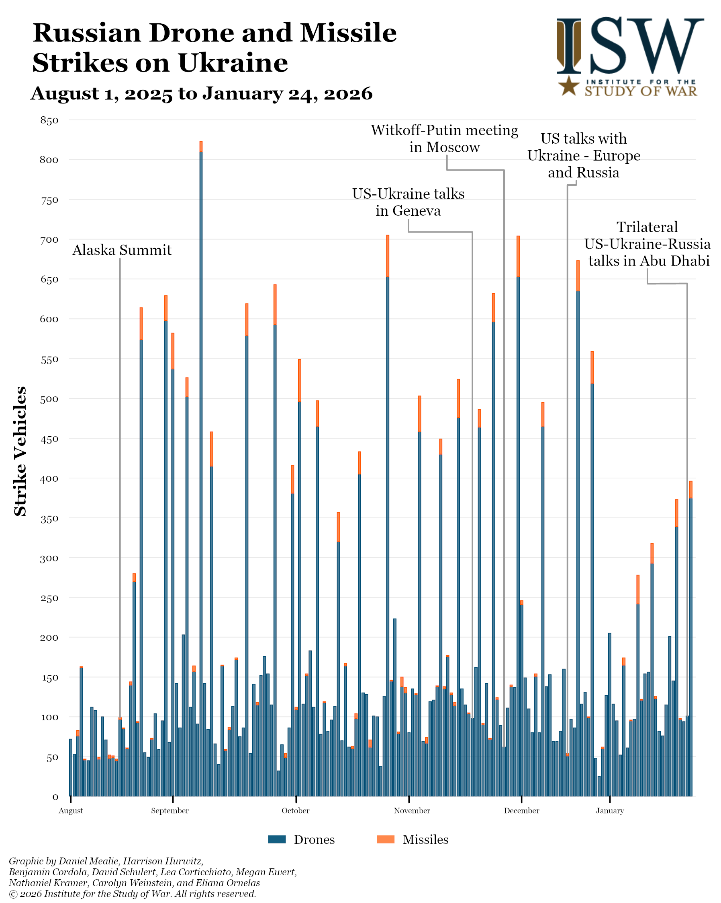

*ArcGIS Pro/Excel · 2025-2026 · Operational strike tracking and database building/management*

---

## China / Taiwan

### China–Taiwan (Map 1)
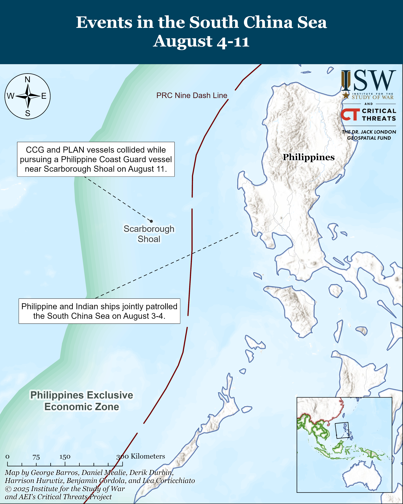

### China–Taiwan (Map 2)
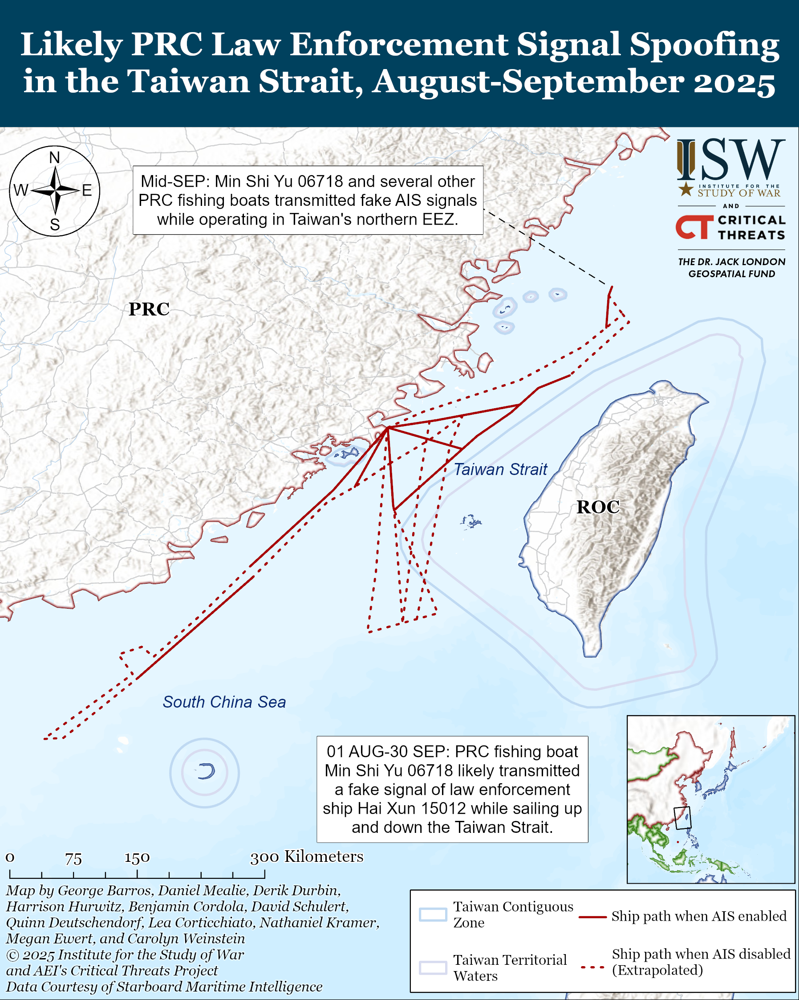

*ArcGIS Pro · August 2025 · Satellite vessel detection*

---

## Moldova

### Moldova Map (1)
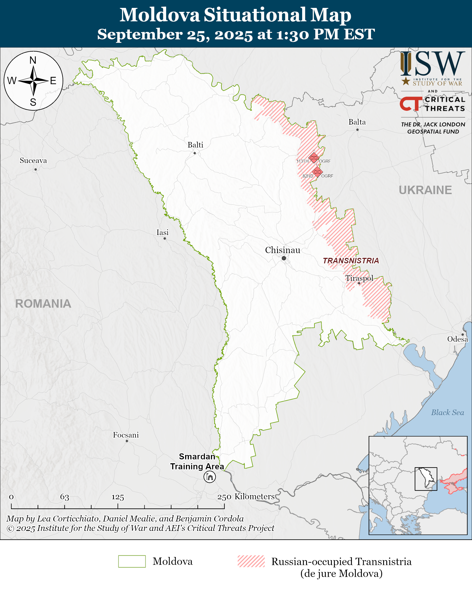

### Moldova Map (2)
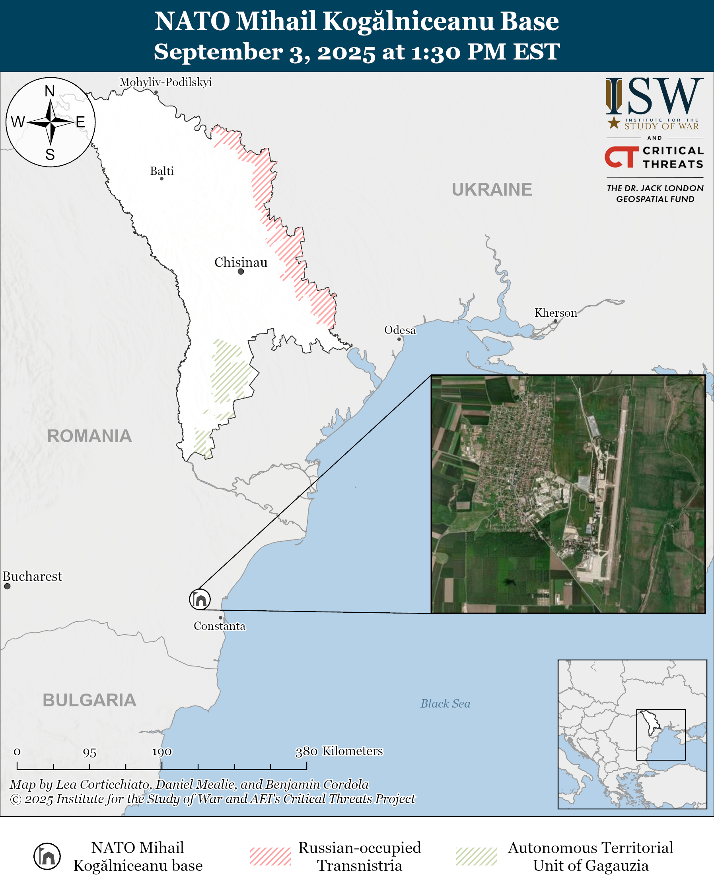

*ArcGIS Pro · September 2025 · OSINT mapping*
---

## US / Local Inequality

### WJCC Inequality
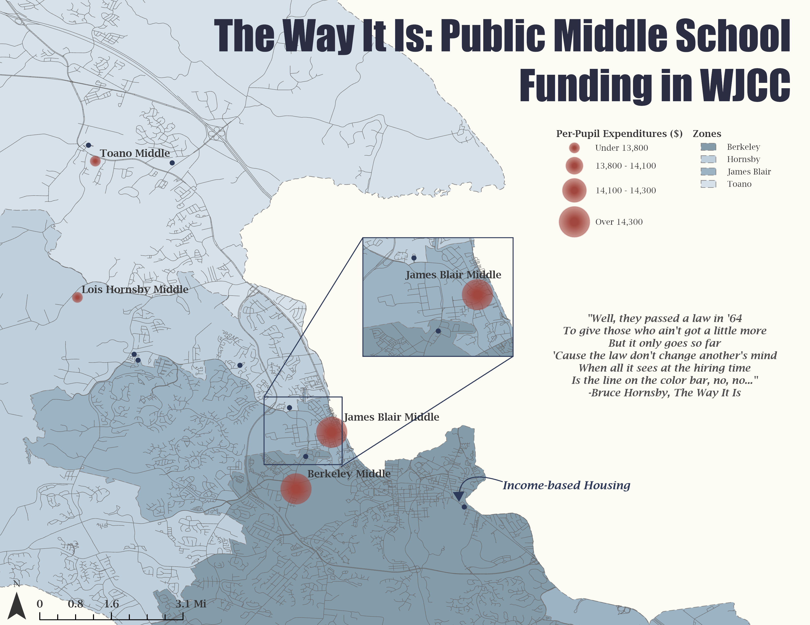

*ArcGIS Pro/Census Data · April 2025 · Academic mapping*

---

